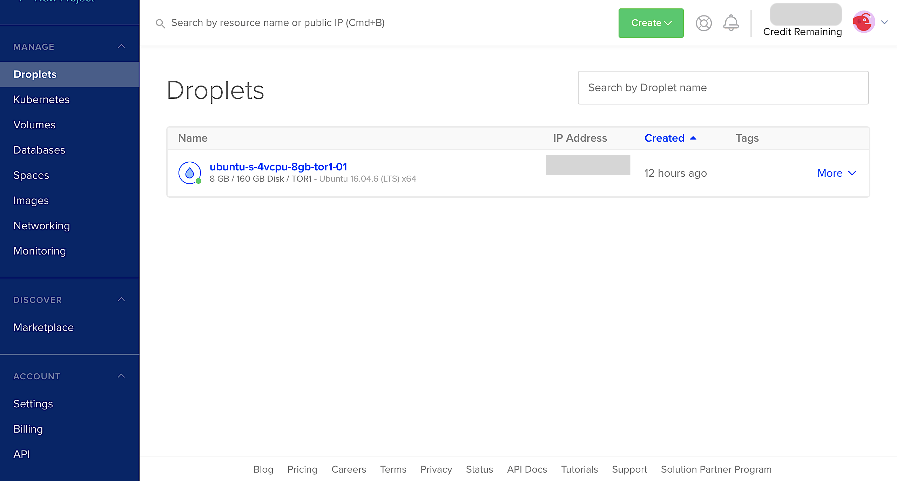

# nodejs-app-jenkins

## Install jenkins in  DigitalOcean



## Build and  deploy a nodejs app

### Part 1: Creating Node.js application
```
$ mkdir nodejs-app
$ cd helloworld
$ npm init

```
#### Install express.js
```
$ npm install express --save
```

### Part 2: Dockerizing our Node.js application

#### Dockerfile content
```
FROM node:12
WORKDIR /app
COPY package.json /app
RUN npm install
COPY . /app
EXPOSE 3000
CMD npm start

```
